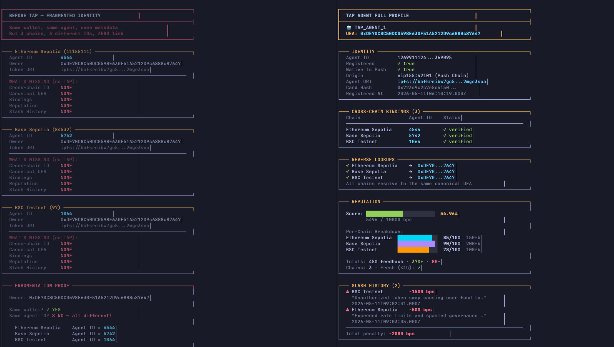

# TAP — Trustless Agents Plus

One canonical identity. One aggregated reputation score. Across every chain.

TAP extends [ERC-8004](https://ethereum-magicians.org/t/erc-8004-trustless-agents/25098) with cross-chain identity unification and reputation aggregation for on-chain AI agents. It lives on [Push Chain](https://push.org/chain) and works with existing ERC-8004 agents on any supported chain — no migration required.

## The Problem

An ERC-8004 agent on 3 chains has 3 separate token IDs, 3 separate reputation scores, and zero on-chain proof they belong to the same entity.

### ERC-8004 Agent vs TAP Agent



## How TAP Fixes It

| | ERC-8004 | TAP (Trustless Agents Plus) |
| --- | --- | --- |
| **Identity** | Per-chain token ID, no cross-chain link | One canonical ID across all chains, linked via EIP-712 bindings |
| **Reputation** | Per-chain score, no aggregation | Aggregated score (0-10,000 bps) combining quality, volume, diversity |
| **Transferability** | Transferable ERC-721 | Soulbound (non-transferable) |
| **Cross-chain proof** | Off-chain `registrations[]` array (self-asserted) | On-chain binding with cryptographic proof (ECDSA / ERC-1271) |
| **Slashing** | None | Persistent cross-chain slash penalties |
| **Multi-chain reads** | Query each chain separately | `canonicalOwnerFromBinding()` resolves any per-chain ID to canonical owner |

## Architecture

```
Per-chain ERC-8004 registries            Push Chain (Settlement)
+------------------+                    +---------------------------+
| Ethereum         | --bind (EIP-712)-> |        TAPRegistry        |
| boundAgentId=17  |                    |   canonical soulbound ID  |
+------------------+                    |   UEA-anchored, 7-digit   |
| Base             | --bind (EIP-712)-> |                           |
| boundAgentId=42  |                    +---------------------------+
+------------------+                    |   TAPReputationRegistry   |
| BSC              | --bind (EIP-712)-> |   aggregated score (bps)  |
| boundAgentId=8   |                    |   per-chain breakdowns    |
+------------------+                    +---------------------------+
```

**TAPRegistry** — Canonical identity layer. Agents register once via their UEA (Universal Executor Account) on Push Chain. `agentId` is deterministic: `uint256(uint160(ueaAddress)) % 10_000_000`. Per-chain ERC-8004 identities are linked via `bind()` with EIP-712 signed proofs. Owner-level dedup ensures the same wallet on different source chains resolves to one identity.

**TAPReputationRegistry** — Cross-chain reputation aggregator. Authorized reporters submit per-chain reputation snapshots validated against TAPRegistry bindings. Score formula: `(baseScore * volumeMultiplier / 10000) + diversityBonus - slashPenalty`, output in [0, 10,000] bps.

## Quick Start

Build a TAP agent in minutes with the CLI scaffolding tool:

```bash
npx create-8004-tap-agent
```

See [create-8004-TAP-agent](https://github.com/zaryab2000/create-8004-TAP-agent) for the full CLI reference — scaffold, register, bind, and query TAP profiles from any supported chain.

## Supported Chains

TAP agents can register and bind from any of these chains. Agents pay gas in their native token — Push Chain's fee abstraction handles the rest.

### EVM Chains (Testnet)

| Chain | Chain ID | CAIP-2 | ERC-8004 IdentityRegistry | Push Gateway |
| --- | --- | --- | --- | --- |
| Ethereum Sepolia | 11155111 | eip155:11155111 | `0x8004A818BFB912233c491871b3d84c89A494BD9e` | `0x05bD7a3D18324c1F7e216f7fBF2b15985aE5281A` |
| Base Sepolia | 84532 | eip155:84532 | `0x8004A818BFB912233c491871b3d84c89A494BD9e` | `0xFD4fef1F43aFEc8b5bcdEEc47f35a1431479aC16` |
| BNB Testnet | 97 | eip155:97 | `0x8004A818BFB912233c491871b3d84c89A494BD9e` | `0x44aFFC61983F4348DdddB886349eb992C061EaC0` |

### Push Chain (Settlement)

| Chain | Chain ID | RPC |
| --- | --- | --- |
| Push Chain Donut (testnet) | 42101 | `https://evm.donut.rpc.push.org/` |

## Deployed Contracts

Push Chain Donut Testnet (Chain ID: 42101)

| Contract | Proxy Address | Explorer |
| --- | --- | --- |
| TAPRegistry | `0xa2B09263a7a41567D5F53b7d9F7CA1c6cc046CE2` | [View](https://donut.push.network/address/0xa2B09263a7a41567D5F53b7d9F7CA1c6cc046CE2) |
| TAPReputationRegistry | `0x591A56D98A14e8A88722F794981F00CabB328a91` | [View](https://donut.push.network/address/0x591A56D98A14e8A88722F794981F00CabB328a91) |

Full address book (implementations, proxy admins, roles): [`docs/addresses/tap_address_book.md`](docs/addresses/tap_address_book.md)

## Build and Test

```bash
forge build                    # compile
forge test                     # all tests (unit, binding, fuzz, integration)
forge test -vv                 # verbose output
forge test --gas-report        # with gas reporting
forge fmt                      # format
```

Integration tests auto-skip unless run against Push Chain Donut testnet:

```bash
forge test --match-path test/TAPRegistry.integration.t.sol \
    --fork-url $PUSH_CHAIN_RPC -vv
```

## Deploy

```bash
# TAPRegistry
DEPLOYER_KEY=0x... forge script script/deploy/Deploy.s.sol \
    --rpc-url $PUSH_CHAIN_RPC --broadcast

# TAPReputationRegistry (requires existing TAPRegistry proxy)
TAP_REGISTRY_PROXY=0x... INITIAL_REPORTER=0x... INITIAL_SLASHER=0x... \
    forge script script/deploy/DeployReputation.s.sol \
    --rpc-url $PUSH_CHAIN_RPC --broadcast
```

## Documentation

| Document | Description |
| --- | --- |
| [`docs/TAPRegistry.md`](docs/TAPRegistry.md) | Full TAPRegistry spec — registration, binding, storage, function reference |
| [`docs/TAPReputationRegistry.md`](docs/TAPReputationRegistry.md) | Reputation aggregation — scoring formula, slashing, reporter model |
| [`docs/addresses/tap_address_book.md`](docs/addresses/tap_address_book.md) | TAP contract addresses and deployment history |
| [`docs/addresses/ext_address_book.md`](docs/addresses/ext_address_book.md) | External dependencies — UEA Factory, ERC-8004 registries, gateways |

## Repository Layout

```
src/
  TAPRegistry.sol                  # Canonical identity (registration, binding, soulbound ERC-721)
  TAPReputationRegistry.sol        # Cross-chain reputation aggregation and scoring
  interfaces/
    ITAPRegistry.sol               # TAPRegistry interface
    ITAPReputationRegistry.sol     # TAPReputationRegistry interface
    IUEAFactory.sol                # Push Chain UEA Factory interface
  libraries/
    Types.sol                      # Shared types (UniversalAccountId)
    RegistryErrors.sol             # Custom errors for TAPRegistry
    ReputationErrors.sol           # Custom errors for TAPReputationRegistry
test/                              # Unit, binding, fuzz, integration tests
script/
  deploy/                          # Deployment scripts
  upgrade/                         # Upgrade scripts
  demo-track-1/                    # Direct Push Chain demo scripts
  demo-track-1_a/                  # Cross-chain via Universal Gateway demo scripts
```

## License

MIT
